# Architecture

Detailed explanation of how the cluster works.

## Overview

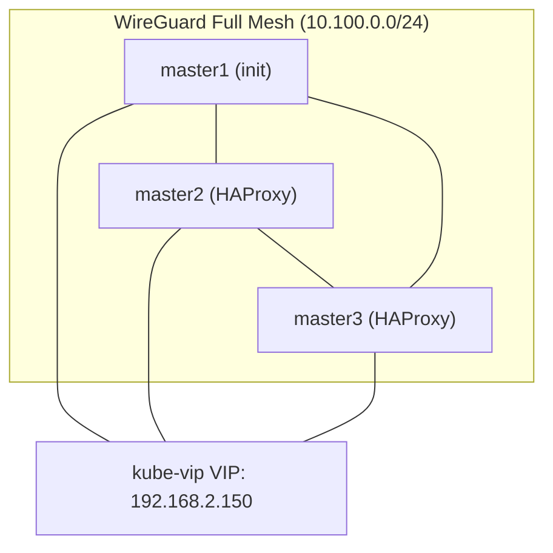

## Components

| Component | Version      | Purpose                                            |
| --------- | ------------ | -------------------------------------------------- |
| k3s       | 1.34.3       | Lightweight Kubernetes with embedded etcd          |
| WireGuard | 1.0.20250521 | Encrypted full‑mesh overlay network                |
| Cilium    | 1.19.3       | CNI, NetworkPolicy, LoadBalancer IP pools          |
| kube‑vip  | 0.9.8        | Layer 2 VIP announcement for LoadBalancer services |
| Longhorn  | 1.11.1       | Distributed replicated block storage               |
| HAProxy   | (NixOS)      | Control‑plane load balancer on non‑init masters    |

---

## WireGuard Mesh

Every node maintains a direct WireGuard tunnel to every other node, forming a full mesh. This design eliminates single points of failure and gives each pod‑to‑pod flow the shortest path.

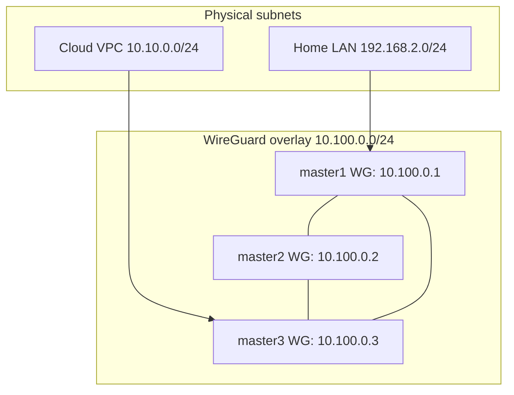

**Why full mesh?**

- No central relay – traffic follows the direct path between nodes.
- Works across NAT with `persistentKeepalive = 25`.
- Control‑plane and pod traffic never leaves the encrypted overlay.

**NAT Traversal:**

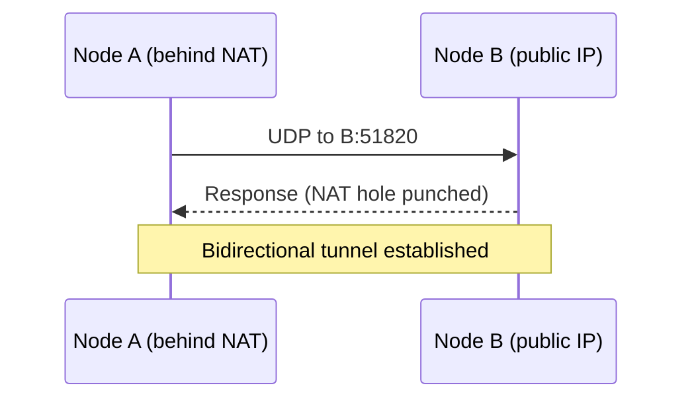

**Endpoint resolution logic:**

1. If a node has an explicit `endpoint`, that DNS name or IP is used.
2. Otherwise, if `cluster.network.domain` is set, the endpoint becomes `<nodeName>.<domain>`.
3. If neither is set, the node's `lanIP` is used (requires static IP).
4. Nodes using DHCP **must** provide an `endpoint` or rely on a cluster‑wide domain; otherwise validation fails.

---

## k3s High Availability

### Control Plane

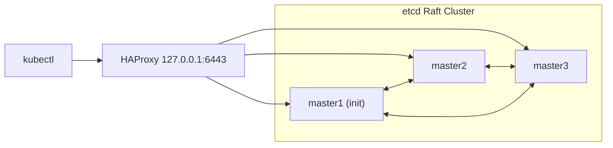

| Step | Action                                                                    |
| ---- | ------------------------------------------------------------------------- |
| 1    | Init node starts with `--cluster-init`.                                   |
| 2    | Other masters join via `--server https://<init-wg-ip>:6443`.              |
| 3    | etcd forms a Raft cluster (quorum required for writes).                   |
| 4    | HAProxy on non‑init masters load‑balances API traffic across all masters. |

**HAProxy configuration** (relevant snippet):

```
defaults
  mode tcp
  timeout connect 5s
  timeout client 50s
  timeout server 50s
  default-server inter 10s downinter 5s rise 2 fall 2 slowstart 60s maxconn 250

backend k3s-masters
  balance roundrobin
  server master1 master1:6443 check
  server master2 master2:6443 check
  server master3 master3:6443 check
```

---

## LoadBalancer IPs

### kube‑vip Leader Election

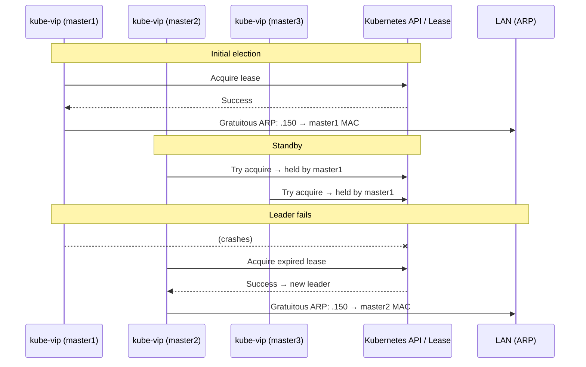

Lease durations are set to 300 s with a 120‑s renewal deadline, providing tolerance against short API‑server stalls

### Service with Real Client IP

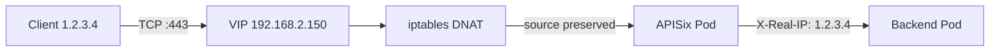

**Required:** `externalTrafficPolicy: Local` on the Service, and Cilium `loadBalancer.mode=hybrid` with DSR over Geneve.

### Cilium IP Pool Allocation

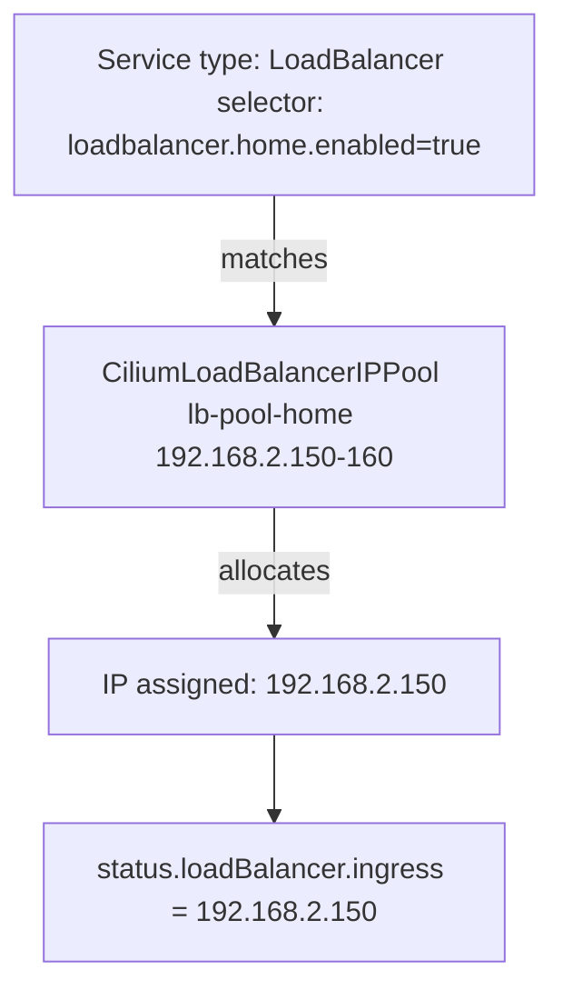

---

## Storage (Longhorn)

### Volume with 2 Replicas

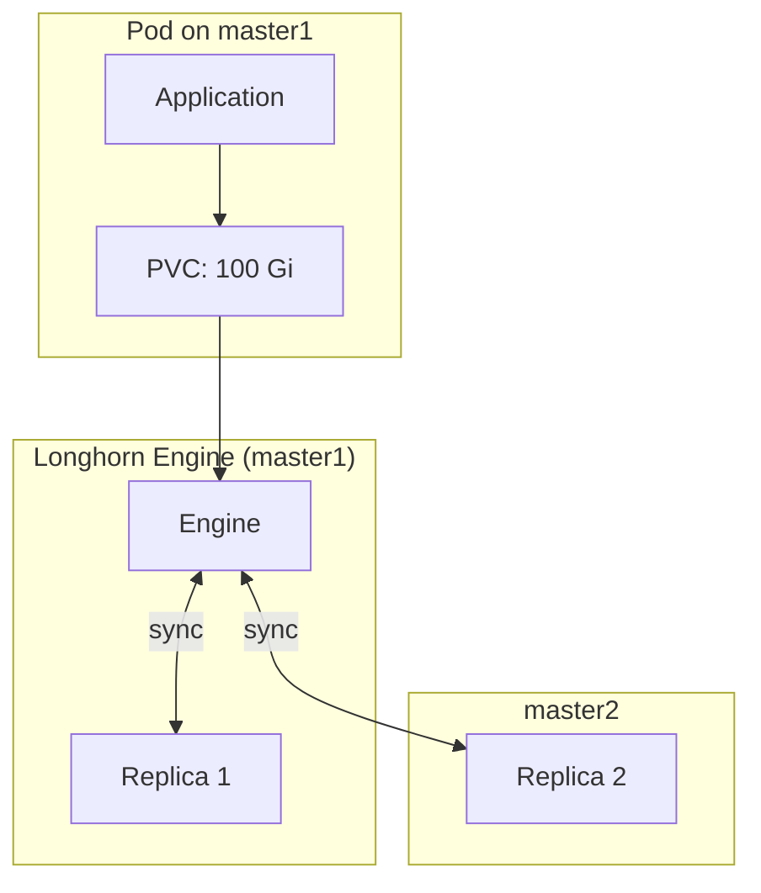

**Recovery scenarios:**

| Failure           | Recovery                                                  |
| ----------------- | --------------------------------------------------------- |
| Replica node dies | Engine rebuilds replica on another healthy node.          |
| Engine node dies  | Engine restarts elsewhere, reattaches surviving replicas. |
| Disk corruption   | Volume is rebuilt from a healthy replica.                 |

Tunings applied for homelab clusters: `replicaAutoBalance=least-effort`, `storageOverProvisioningPercentage=100`, `defaultDataLocality=best-effort`.

---

## Network Policy

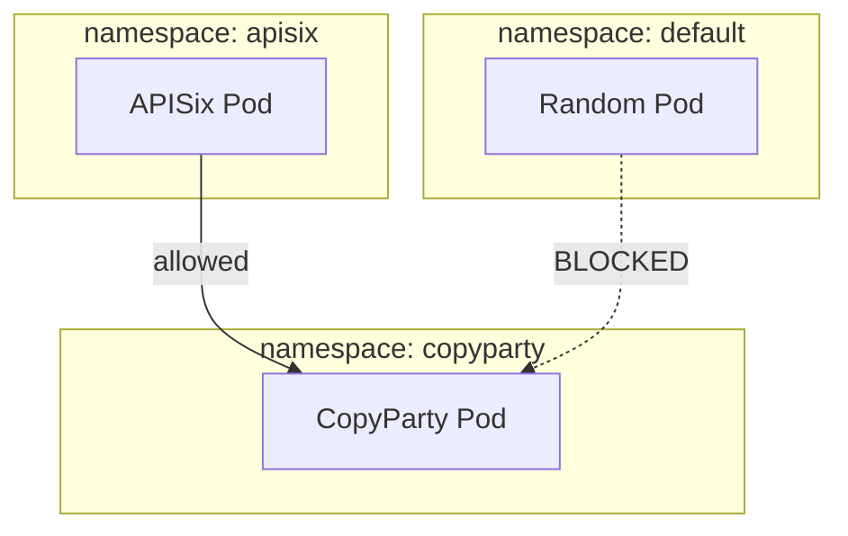

Enforced by Cilium `NetworkPolicy` objects.

---

## Complete Traffic Flow: WAN → Pod

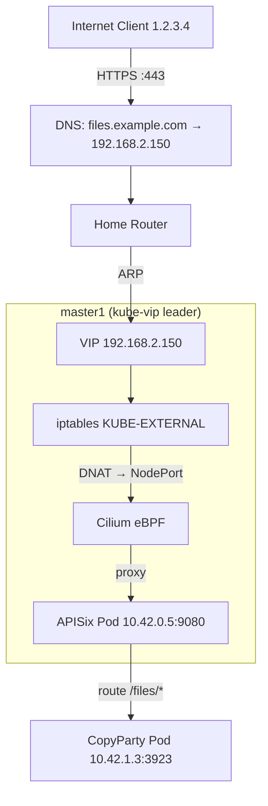

### Step‑by‑Step Breakdown

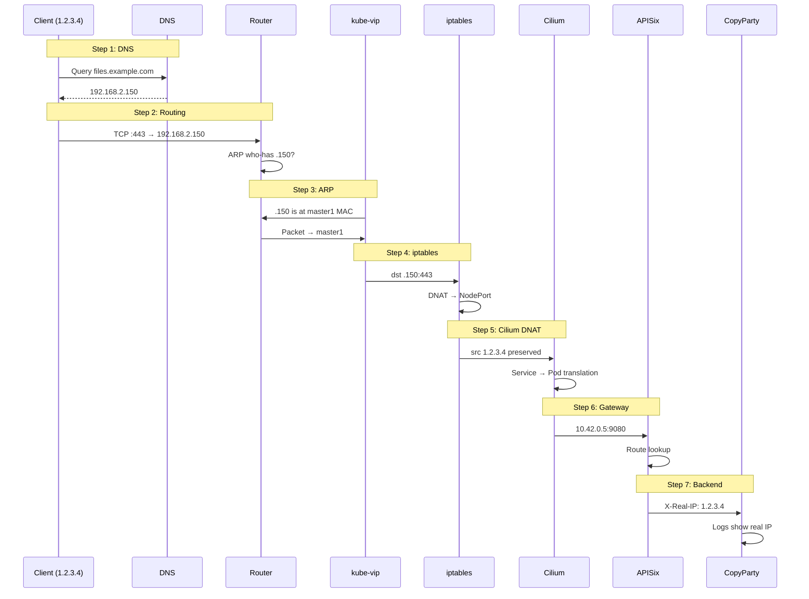

### Packet Transformations

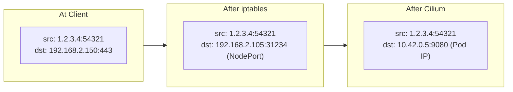

### What Could Go Wrong?

| Issue                            | Symptom                      | Cause                                            |
| -------------------------------- | ---------------------------- | ------------------------------------------------ |
| No anti‑affinity on APISix       | Intermittent 503 errors      | VIP traffic hits a node without an APISix pod.   |
| `externalTrafficPolicy: Cluster` | Real IP lost (shows node IP) | SNAT when forwarding to another node.            |
| kube‑vip leader dies             | ~1–2 s downtime              | Normal lease expiration; new leader takes over.  |
| Cilium not ready                 | Connection refused           | Pod exists but Cilium hasn't programmed BPF yet. |

---

## Deployment Model

The cluster is deployed using the `deploy` script (see README). Key points:

- **Init node** – installed via `nixos-anywhere` (`deploy init master1`).
- **Other nodes** – updated in place with `nixos-rebuild` (`deploy rebuild <node>`).
- All commands support an optional `--jump` bastion for nodes behind a firewall.
- Cluster validation (`helpers.validateCluster`) catches misconfigurations (duplicate IPs, missing endpoints, etc.) at evaluation time.

---

<p align="right"><sub>Generated by Deepseek-V4</sub></p>
