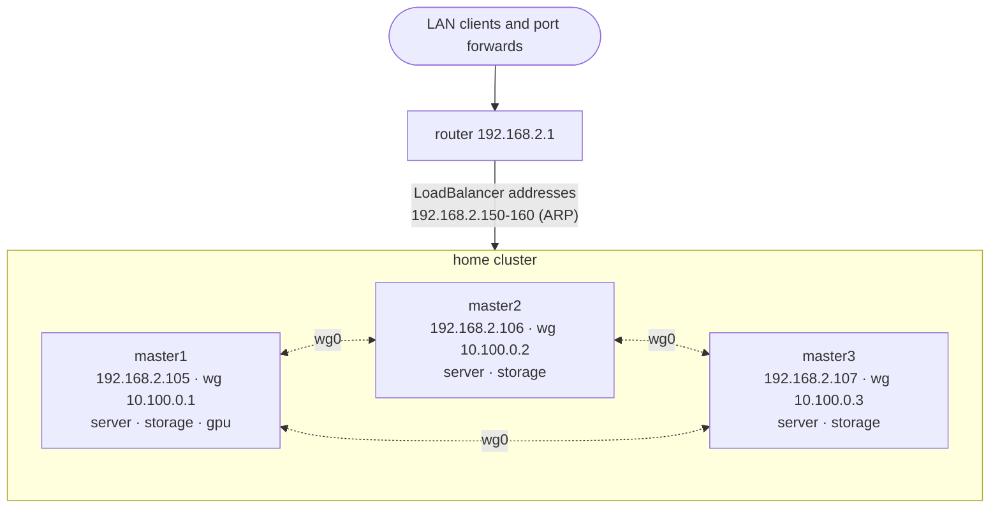
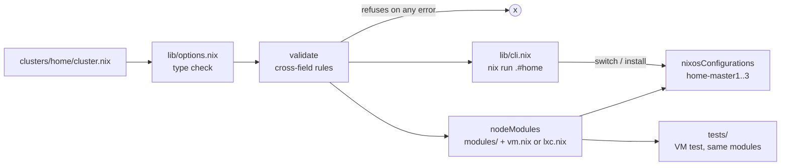
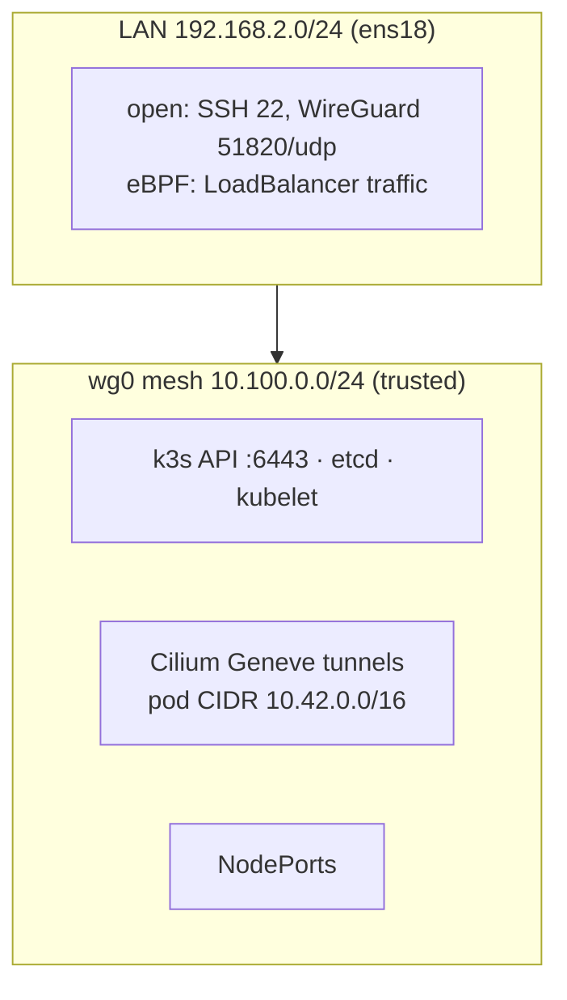
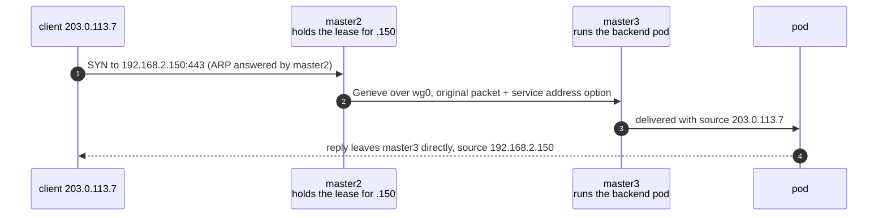
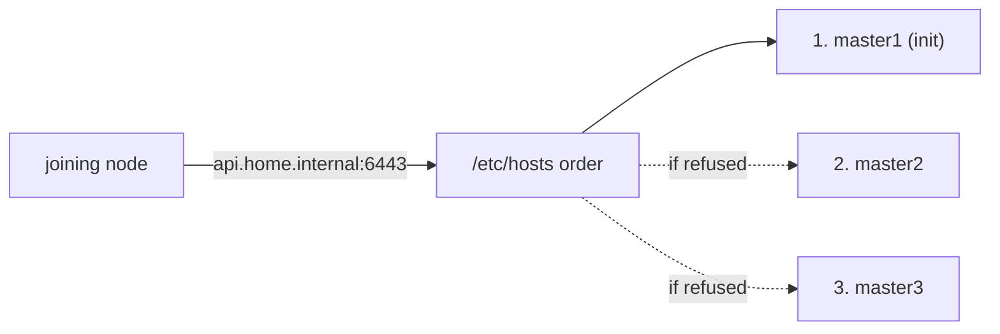
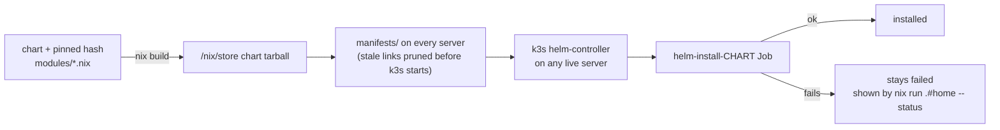
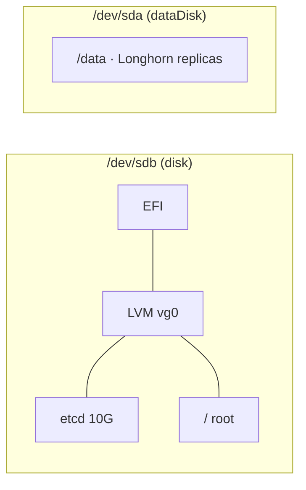
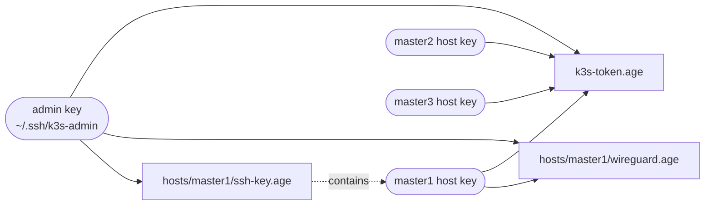

# Architecture

home is three NixOS machines, `master1` to `master3`. Each one is a k3s
server, an etcd member, a Longhorn storage node and a workload node, and
`master1` also has the GPU. Everything below is generated from
`clusters/home/cluster.nix`.

```mermaid
flowchart TB
  client([LAN clients and port forwards])
  router[router 192.168.2.1]
  subgraph home["home cluster"]
    direction LR
    m1["master1<br/>192.168.2.105 · wg 10.100.0.1<br/>server · storage · gpu"]
    m2["master2<br/>192.168.2.106 · wg 10.100.0.2<br/>server · storage"]
    m3["master3<br/>192.168.2.107 · wg 10.100.0.3<br/>server · storage"]
    m1 <-. wg0 .-> m2
    m2 <-. wg0 .-> m3
    m1 <-. wg0 .-> m3
  end
  client --> router
  router -- "LoadBalancer addresses<br/>192.168.2.150-160 (ARP)" --> home
```

## From `cluster.nix` to machines

```mermaid
flowchart LR
  cfg["clusters/home/cluster.nix"] --> opts["lib/options.nix<br/>type check"]
  opts --> val["validate<br/>cross-field rules"]
  val -->|refuses on any error| stop((x))
  val --> mods["nodeModules<br/>modules/ + vm.nix or lxc.nix"]
  mods --> sys["nixosConfigurations<br/>home-master1..3"]
  val --> cli["lib/cli.nix<br/>nix run .#home"]
  mods --> test["tests/<br/>VM test, same modules"]
  cli -->|switch / install| sys
```

`flake.nix` reads `clusters/home`. `lib/default.nix` type-checks it against
`lib/options.nix` and applies the cross-field rules in `validate`; one failure
and nothing evaluates. It then builds one NixOS system per node from
`modules/` plus `vm.nix` or `lxc.nix`, with the checked cluster and node passed
as module arguments, and builds the cluster command from `lib/cli.nix`. The VM
test builds its machines from the same `nodeModules`, so it runs what gets
deployed apart from disks and boot loader.

Roles are plain module conditions:

| module | active on |
| --- | --- |
| `k3s.nix` | every node; server or agent from the `server` role |
| `cilium.nix`, `network-policy.nix`, `loadbalancer.nix` | servers |
| `storage.nix` | every node once any node has `storage`: clients everywhere, replicas on storage nodes, the chart on servers |
| `gpu.nix` | driver on `gpu` nodes, device plugin chart on servers |

## Network

```mermaid
flowchart TB
  subgraph lan["LAN 192.168.2.0/24 (ens18)"]
    direction LR
    lanin["open: SSH 22, WireGuard 51820/udp<br/>eBPF: LoadBalancer traffic"]
  end
  subgraph mesh["wg0 mesh 10.100.0.0/24 (trusted)"]
    direction LR
    k8s["k3s API :6443 · etcd · kubelet"]
    gen["Cilium Geneve tunnels<br/>pod CIDR 10.42.0.0/16"]
    np["NodePorts"]
  end
  lan --> mesh
```

- Every node has a `wgIP` on `wg0`, a WireGuard full mesh. Peers in the same
  `location` connect over the LAN, others through their `endpoint`. Each peer
  routes only its own /32. Endpoints given as DNS names are resolved again
  every 5 minutes, so a changed public address heals by itself.
- k3s uses the WireGuard address as node IP and binds the API and supervisor
  to it. Its flannel, kube-proxy and kube-router are off. Cilium is the CNI:
  pods reach each other through Geneve tunnels between node IPs, so packets
  cross `wg0` encrypted, WireGuard never needs to know pod CIDRs, and pod
  addresses arrive unchanged. Cilium's MTU follows `network.wgMTU`.
- Cilium replaces kube-proxy in eBPF. Its agents reach the API through every
  server's `wgIP` (`k8s.apiServerURLs`), because no Service works before they
  run. NodePorts listen on `wg0` only.
- The LAN firewall opens SSH and the WireGuard port. `wg0`, Cilium's devices
  and the pods' `lxc*` veths are trusted. LoadBalancer traffic is handled by
  eBPF on the LAN interface before the input chain.

### LoadBalancer traffic and client addresses

```mermaid
sequenceDiagram
  autonumber
  participant C as client 203.0.113.7
  participant A as master2<br/>holds the lease for .150
  participant B as master3<br/>runs the backend pod
  participant P as pod
  C->>A: SYN to 192.168.2.150:443 (ARP answered by master2)
  A->>B: Geneve over wg0, original packet + service address option
  B->>P: delivered with source 203.0.113.7
  P-->>C: reply leaves master3 directly, source 192.168.2.150
```

- Cilium LB IPAM gives every LoadBalancer service an address from
  `loadBalancerIPs`. The entries are grouped by the location of the nodes
  whose `address` subnet contains them, and each group becomes an address pool
  plus an L2 announcement policy limited to those nodes and their LAN
  interface. Entries outside every LAN form a pool only BGP can reach.
- One node per service holds a lease and answers ARP. If it fails, another
  takes over within 3 to 7 seconds.
- Direct server return: the announcing node hands each connection to a
  backend over Geneve, carrying the service address in a Geneve option, and the
  backend's node answers the client itself. Pods see the real client address.
  `service.cilium.io/forwarding-mode: snat` turns this off per service.
- With `bgp` set, Cilium's BGP control plane peers each router with the nodes
  on its subnet and advertises every LoadBalancer address (`bgp=off` on a
  service excludes it). home doesn't use BGP.

## Control plane

```mermaid
flowchart LR
  new["joining node"] -->|"api.home.internal:6443"| hosts["/etc/hosts order"]
  hosts --> s1["1. master1 (init)"]
  hosts -.->|if refused| s2["2. master2"]
  hosts -.->|if refused| s3["3. master3"]
```

`master1` (the `init` server) started etcd with `--cluster-init`. Every other
node joins through `api.home.internal`, which `/etc/hosts` maps to the other
servers' WireGuard addresses, `init` first. k3s connects to the first address
that accepts (it uses Go's resolver, which keeps the file order; glibc would
reorder by address prefix), and every server's certificate carries the name.
A server that runs but hasn't joined accepts the connection and then refuses
everyone, so it must never come before a working one; that's why the order is
fixed. After joining, servers use the etcd member list and agents use k3s'
client load balancer. `--cluster-init` is ignored once a node has etcd data,
so `init` can move to any server that has joined.

- Secrets in etcd are encrypted (`--secrets-encryption`).
- PodSecurity enforces `baseline` (and warns about `restricted`) outside
  `kube-system` and `longhorn-system`. Namespaces with privileged pods opt out
  with `pod-security.kubernetes.io/enforce=privileged`.
- Every other namespace gets the `default-deny` NetworkPolicy (see
  [CONFIGURATION.md](CONFIGURATION.md#network-policy)). A `default-deny` unit
  on each server watches namespaces and applies or removes it. Cilium enforces
  it, and `policyCIDRMatchMode=nodes` lets `ipBlock` rules select node
  addresses.
- The k3s package is `k3s_<k3sVersion>` from the pinned nixpkgs: lock updates
  change the patch release, `cluster.nix` changes the minor release.
- The kubelet keeps `reserved.server` away from pods (`system-reserved`), so a
  runaway workload is evicted or OOM-killed before etcd and the API server run
  short.

## Add-ons

```mermaid
flowchart LR
  pin["chart + pinned hash<br/>modules/*.nix"] -->|nix build| store["/nix/store chart tarball"]
  store --> dir["manifests/ on every server<br/>(stale links pruned before k3s starts)"]
  dir --> hc["k3s helm-controller<br/>on any live server"]
  hc --> job["helm-install-CHART Job"]
  job -->|ok| up["installed"]
  job -->|fails| abort["stays failed<br/>shown by nix run .#home -- status"]
```

Cilium, CoreDNS (two replicas instead of k3s' one), Longhorn and the NVIDIA
device plugin are Helm charts fetched at build time with pinned hashes and
written to every server's manifest directory. Whichever server is alive
installs and upgrades them, and nothing but container images is downloaded at
boot.

- Cilium is a bootstrap chart: its installer Job runs on a server's host
  network against `127.0.0.1:6443`, which k3s serves next to the `wgIP`,
  because there's no pod network yet.
- `failurePolicy: abort` keeps a failed upgrade failed for a human to look at,
  instead of uninstalling and reinstalling it.
- The charts' manifest files must not share a name with k3s' bundled manifests
  (`coredns.yaml`, `traefik.yaml`, ...), which k3s rewrites on every start.
- Before k3s starts, servers delete links in the manifest directory that point
  into the Nix store but are no longer configured; the NixOS k3s module leaves
  them behind and k3s would keep applying them. Removing a chart stops it being
  reapplied; `kubectl delete helmchart <name> -n kube-system` uninstalls it.
- CoreDNS replicas never share a node and leave a failed node after 30 seconds
  instead of 300, so name resolution recovers in about a minute and a half.
- Longhorn keeps replicas on `/data` of storage nodes only
  (`createDefaultDiskLabeledNodes`), `min(3, storage nodes)` of them, and
  deletes pods of a dead node so their volumes can attach elsewhere.
- `registries` becomes `/etc/rancher/k3s/registries.yaml`. home maps its
  in-cluster registry name to the registry's LoadBalancer address
  `192.168.2.151:5000`, since nodes don't resolve cluster DNS.

## Nodes

```mermaid
flowchart LR
  subgraph sdb["/dev/sdb (disk)"]
    efi[EFI] --- lvm["LVM vg0"]
    lvm --- etcd["etcd 10G"]
    lvm --- root["/ root"]
  end
  subgraph sda["/dev/sda (dataDisk)"]
    data["/data · Longhorn replicas"]
  end
```

- VMs are partitioned by disko: EFI and LVM on `disk` (a 10G etcd volume and
  root) and `/data` on `dataDisk`. Every VM gets the etcd volume so it can
  become a server later.
- LXC containers take kernel, modules and kernel settings from the Proxmox
  host. A preflight unit checks them, including the BPF filesystem Cilium
  needs, before k3s starts; see [lxc.md](lxc.md).
- Nodes carry no documentation or GUI. They do carry debugging tools, comma
  and flakes (see [OPERATIONS.md](OPERATIONS.md#debugging-on-a-node)), and
  servers set `KUBECONFIG` so `admin` can use `kubectl` without sudo. The Nix
  store is garbage-collected weekly (14 days).

## Identity and secrets

An arrow means "can decrypt":

```mermaid
flowchart LR
  admin(["admin key<br/>~/.ssh/k3s-admin"])
  hk1(["master1 host key"])
  hk2(["master2 host key"])
  hk3(["master3 host key"])
  tok["k3s-token.age"]
  wg1["hosts/master1/wireguard.age"]
  ssh1["hosts/master1/ssh-key.age"]
  admin --> tok & wg1 & ssh1
  hk1 --> tok & wg1
  hk2 --> tok
  hk3 --> tok
  ssh1 -. contains .-> hk1
```

Each node has a managed SSH host key, generated by `secrets sync` and stored
encrypted for the admin keys. `install` puts it on the node, the generated
`known_hosts` pins it, and agenix uses it to decrypt the node's secrets
(master2 and master3 have their own `wireguard.age` and `ssh-key.age` like
master1's, left out of the diagram):

| file | readable by |
| --- | --- |
| `k3s-token.age` | admin, every node |
| `etcd-s3.age` | admin, servers (only when `etcdS3` is set; home has none) |
| `hosts/<node>/wireguard.age` | admin, that node |
| `hosts/<node>/ssh-key.age` | admin |

Only `admin` may log in over SSH, only with a key in `admin.pub`
(`~/.ssh/authorized_keys` is ignored and users are immutable), and it has
passwordless sudo, which deployment needs. Root and passwords are disabled.
LXC consoles log in as `admin` automatically, since reaching them requires
control of the Proxmox host. Protect the admin key with a passphrase: it is
root on every node. Losing or rotating keys is covered in
[DISASTER-RECOVERY.md](DISASTER-RECOVERY.md).

Generated by Opus 5.5

